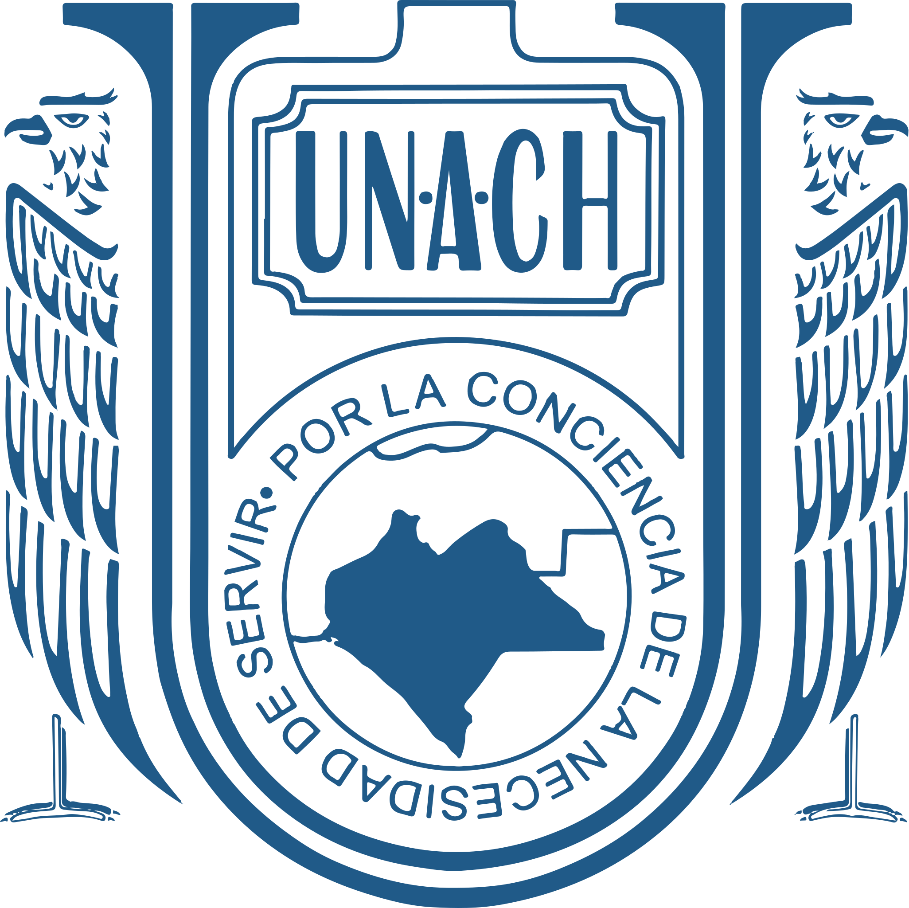

# Universidad Autónoma De Chiapas

## Projecto Final: Desarrollo De Aplicaciones Web Y Moviles.

### **Catedrático:** DR. JORGE HUMBERTO RUIZ OVALLE

### **Integrantes del equipo**

#### - José Gilberto Guzmán Gutiérrez.

#### - Jaci Annet Lucas Eulogio.

#### - Cedrick Marcial Quintero.

#### - Luis Gerardo Mendoza Gómez.

#### Tuxtla Gutiérrez Chiapas. 21 de octubre del 2023.

# Informe.

Para la realización de este trabajo se nos solicita que utilizenmos un metodo sistematico para la redacción de este documento, por ende y por su naturaleza, partiremos del metodo cientifico, este, adaptandolo a nuestro contexto actual.

1. Observación.

2. Pregunta de investigación.

3. Hipótesis.

4. Diseño experimental o de investigación.

5. Recopilación de datos.

6. Análisis de datos.

7. Conclusiones.

8. Comunicación de resultados.

9. Repetición y revisión.
